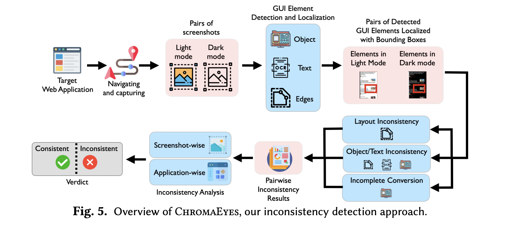
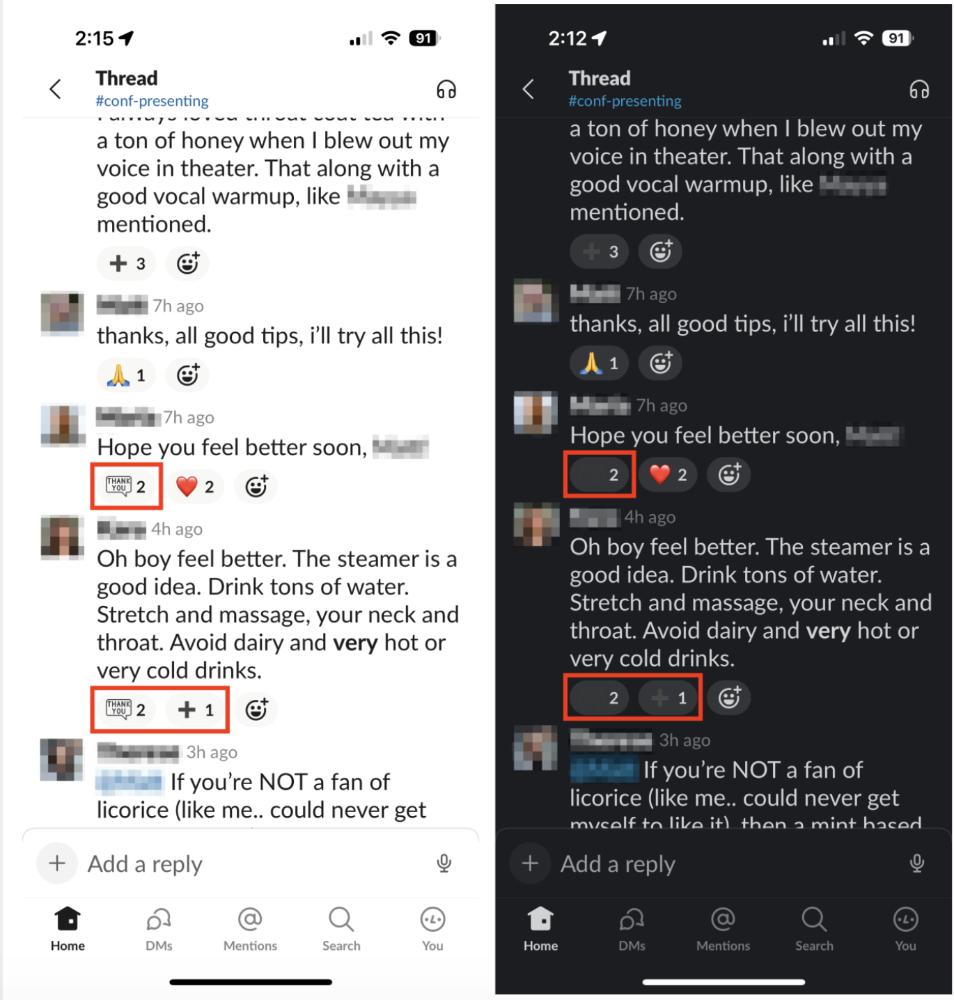
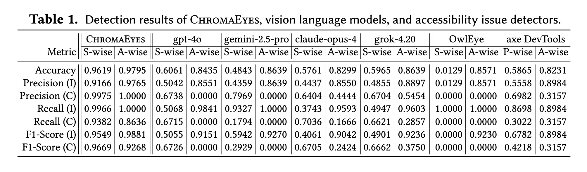
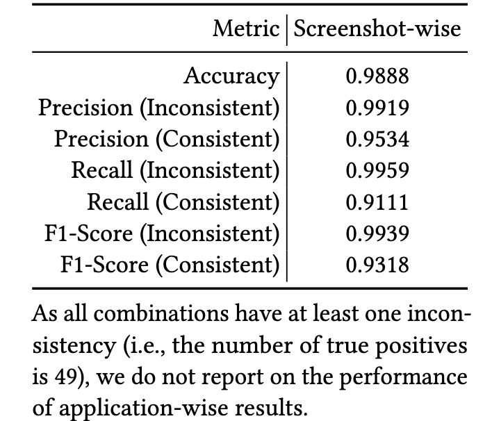
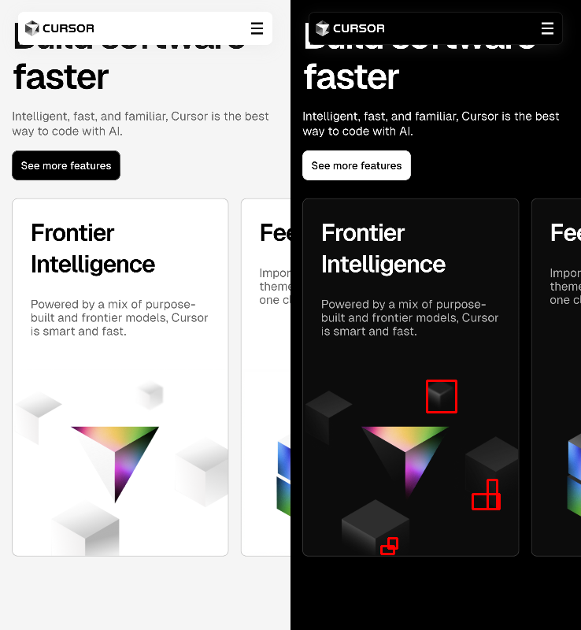
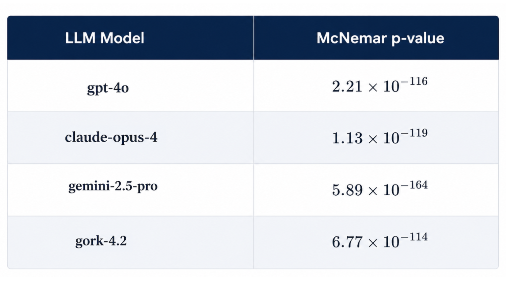
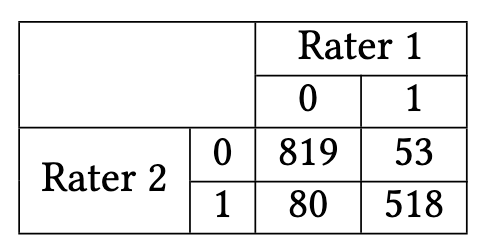
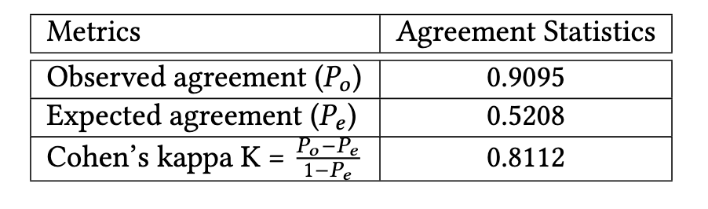

# ChromaEyes-ISSTA-2026
Replication package of ChromaEyes (ISSTA 2026)

----

### Embracing the Dark Side: Detecting and Repairing Inconsistencies between Light and Dark Modes of Web Applications

ChromaEyes detects GUI inconsistency between light and dark mode in web applications. 
The term inconsistency refer to a GUI state where its elements are well-designed in light mode,
appearing visually cohesive, functional, and aligned with brand identity, but in dark mode, they
may be poorly crafted, with low-quality graphics, weak contrast, and disrupted brand aesthetics (or vice versa).
ChromaEyes detects four types of inconsistency.

The four types of inconsistency are:layout inconsistencies based
on the detected edges, GUI widget elements (object and text) inconsistencies based on the
detected edge, object, and text information, and incomplete conversion inconsistencies based
on the detected objects.

**Example of four types of inconsistency**
<table>
<tr>
<td align="center" style="padding-right: 30px;">
 
(a) Inconsistent layout due to incorrect edge conversion (button shape missing).
</td>

<td align="center">
 
(b) Less decipherable text due to incorrect color conversion.
</td>
</tr>

<tr>
<td align="center" style="padding-right: 30px;">
 
(c) Invisible icons due to incorrect conversion. 
</td>

<td align="center">
 
(d) Incomplete layout conversion.
</td>
</tr>
</table>

---

## Result 
ChromaEyes is evaluated  on 2,009 screenshot
pairs captured from 196 real web applications (147 with native dark mode support and 49 with browser
extension-based conversion). ChromaEyes achieves 96.19% accuracy at the screenshot level and 97.95% at
the application level, significantly outperforming vision-language models (e.g., GPT-4o) and state-of-the-art
accessibility issue detectors (e.g., OwlEye, axe DevTools).

### RQ1: Inconsistency Detection

### RQ2: Comparison with vision language models and accessibility issue detectors

**Runtime cost of ChromaEyes and other tools**

- ChromaEyes: 7.11 sec 
- GPT-4.0: 10.50 sec 
- Claude: 13.54 sec 
- Gemini-2.5-pro: 24.69 sec 
- Grok-4.20: 53.80 sec 
- OwlEye: 0.42 sec 
- axe DevTools: 5.7 sec

### RQ3: Inconsistency Detection when Extensions are Applied

----

### False Positives and Negatives

<table>
<tr>
<td align="center" style="padding-right: 30px;">
 
(a) False positive due to the limitation of the object
detection model
</td>

<td align="center">
 
(b) False negative due to the sensitivity of the object
detection model 
</td>
</tr>

</table>

----

## Sensitivity Analysis 

**IoU Sensitivity Analysis Screenshot Wise**

**colDiff Sensitivity Analysis**

**areaDiff Sensitivity Analysis Screenshot Wise**

----

## McNemarTest
 The results are statistically tested by McNemar’s test, the detection is a binary classification, there are four different outcomes:
(1) both ChromaEyes and another tool correctly detect the (in)consistency between screenshot
pairs, (2) both incorrectly detect, (3) only ChromaEyes incorrectly detects, or (4) only another tool
incorrectly detects. For all pairs (i.e., ChromaEyes vs. another tool), the p-values are all smaller than 0.01.

----

## Inter-rater reliability metrics (Cohen's kappa)
To strengthen the reliability of our ground-truth labels, we added an explicit inter-rater reliability
analysis. Two authors independently labeled the screenshot pairs as either consistent or inconsistent.

<table>
<tr>
<td align="center" style="padding-right: 30px;">
 
(a) Confusion Matrix for 1,470 cases. The label 0 indicates the number of consistent pairs of screenshots
decided by the rater. Similarly, 1 indicates the number of inconsistent pairs of screenshots.
</td>

<td align="center">
 
(b) Cohen’s Kappa Statistics. (𝑃𝑜 ) is the proportion of times the two raters actually agree. (𝑃𝑒 ) is the
proportion of agreement expected purely by random chance. 
</td>
</tr>

</table>

---

## ChromaEyes dataset is available at [Zenodo](https://zenodo.org/records/17141637)

-----
## Replication 

**i. Environment**
- macos arm64 

- IDE- Pycharm

- Python version: 3.12 

- Chromedriver version: 139.0.7258.66 

**ii. Quick overview of the directory**

- [detection](ChromaEyes/detection): detect the inconsistency between light and dark mode screenshot pairs

- [data_collection](ChromaEyes/data_collection): collect the dataset 

- [example_dataset](example_dataset): sample dataset to run the quick detection
- [llm_fewshot](llm_fewshot): few shot prompt with LLM api (gpt4.0, gemini-2.5, claude-opus-4, grok-4)
- [statistical_analysis](statistical_analysis): cohen_kappa between two annotator; false positive and negatives; McNemar test ; sensitivity analysis for IoU, areaDiff, ColDiff for each parameter by ±10% and ±20% on randomly selected 323 pairs

### Quick Run

 - Inconsistency Detection 
   - Run [chroma_eye.py](ChromaEyes/detection/chroma_eye.py)
   
   - To run the file, please make sure to pass the input absolute path 
   
   - For more details: [description](ChromaEyes/detection/description)

### To replicate the work from scratch 

1. Collect the dataset

   - To collect the dataset with extension: [app_with_extension](ChromaEyes/data_collection/app_with_extension)
   
   - To collect the dataset with native application light and dark mode: [native_app_datacollection.py](ChromaEyes/data_collection/native_lightdark_app/native_app_datacollection.py)
   
   - For more details: [description](ChromaEyes/data_collection/description)
   
2. Preprocessing(chromaeye/chroma_detection/pre_processing)

  -  Verify the identical pairs of screenshots: [check_sc_pairs.py](ChromaEyes/detection/pre_processing/check_sc_pairs.py)

  -  Text detection run the upstage OCR: [upstage_ocr.py](ChromaEyes/detection/pre_processing/upstage_ocr.py)

  - Detect GUI element using UIED detection - [UIED](https://github.com/MulongXie/UIED)

  - Run: [resize_image.py](ChromaEyes/detection/pre_processing/resize_image.py)

  - Run: [combine_uied_ld_detection.py](ChromaEyes/detection/pre_processing/combine_uied_ld_detection.py)

3. Once you have collected the dataset and performed the preprocessing, 
   - The detection process is the same as quick run

----

