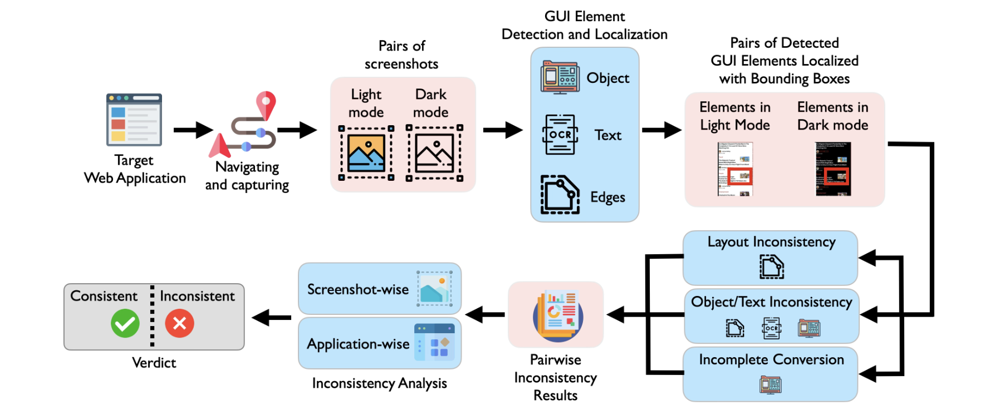
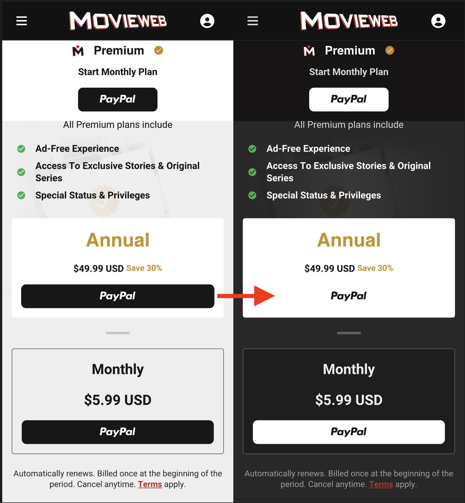
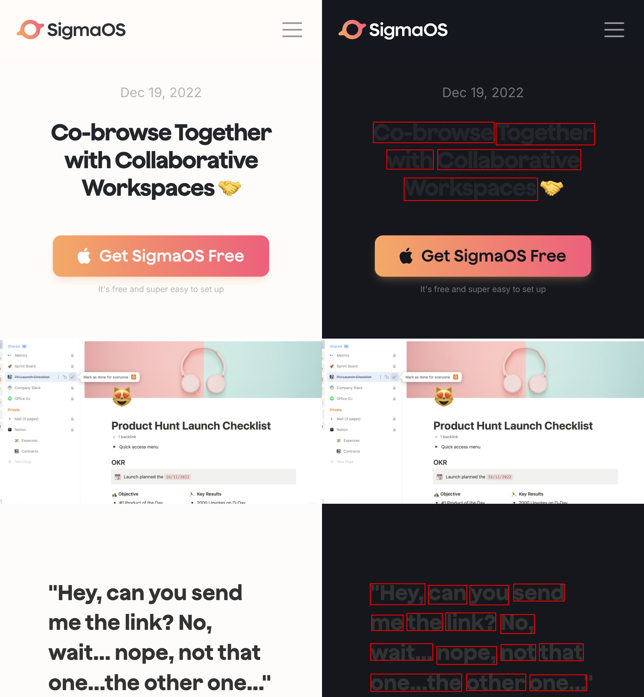
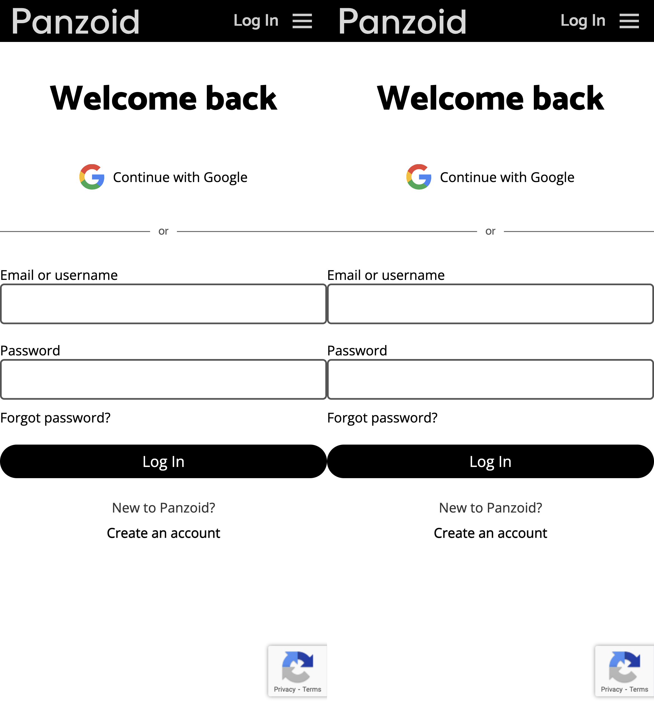
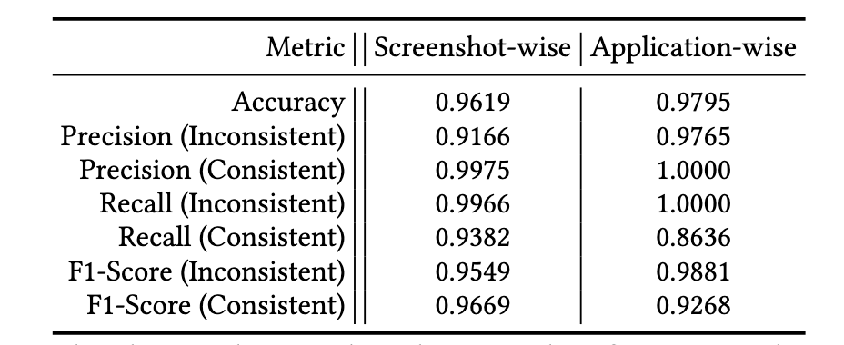
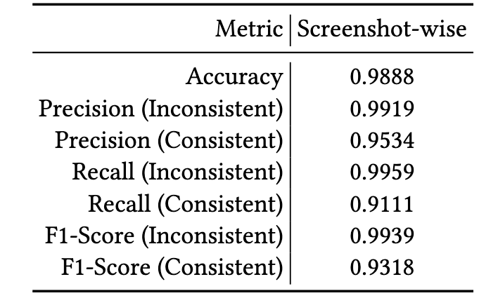
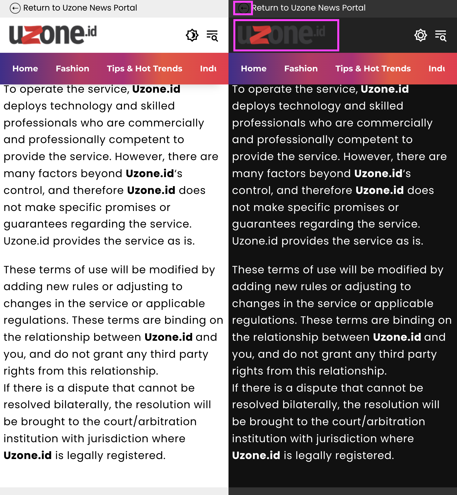
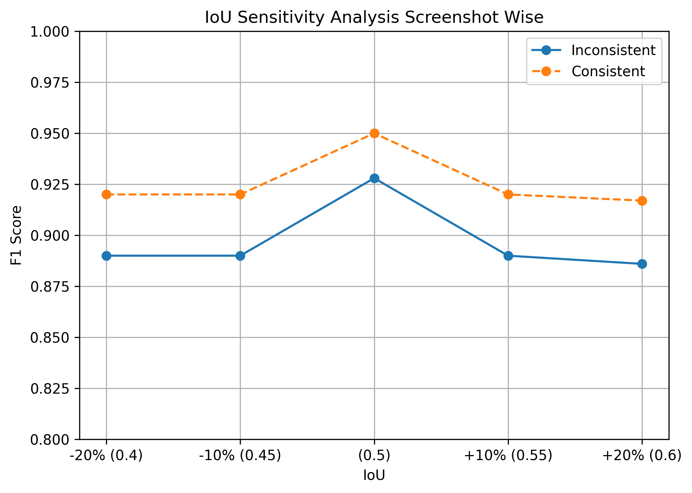
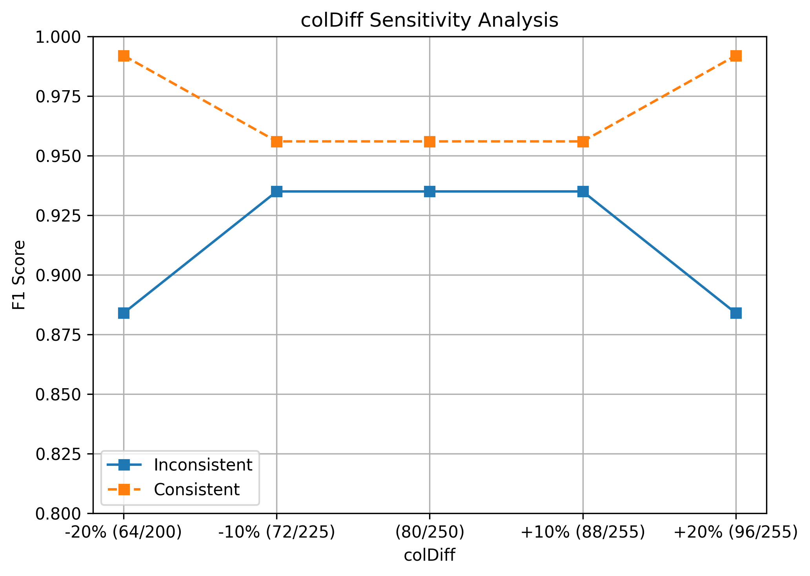
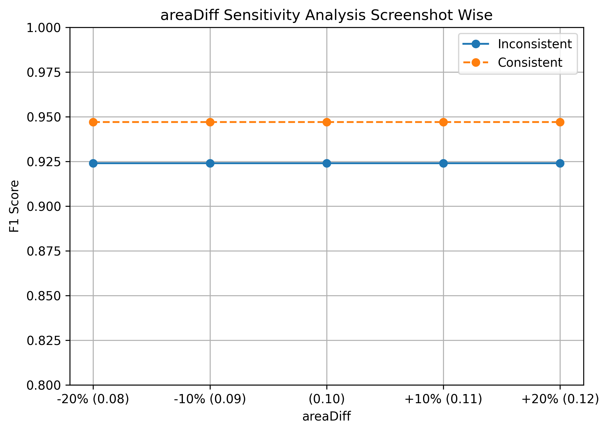

# ChromaEyes-ISSTA-2026
Replication package of ChromaEyes (ISSTA 2026)

----

## Table of Contents

- [Introduction](#embracing-the-dark-side-detecting-and-repairing-inconsistencies-between-light-and-dark-modes-of-web-applications)
- [Our Approach](#our-approach)
- [Inconsistency between Light and Dark mode](#inconsistency-between-light-and-dark-mode)
- [Experimental Setup](#experimental-setup)
- [Results](#results-)
- [False Positives and Negatives](#false-positives-and-negatives)
- [Statistical Analysis](#statistical-analysis)
- [Dataset](#dataset)
- [Directory Structure](#directory-structure)
- [Replication](#replication)


----

#  ChromaEyes: Detecting Inconsistencies of User Interface Elements between Light and Dark Modes of Web Applications


**ChromaEyes** detects GUI inconsistency between light and dark mode in web applications. 
The term inconsistency refer to a GUI state where its elements are well-designed in light mode,
appearing visually cohesive, functional, and aligned with brand identity, but in dark mode, they
may be poorly crafted, with low-quality graphics, weak contrast, and disrupted brand aesthetics (or vice versa).
ChromaEyes detects four types of inconsistency.


## Our Approach



<p align="center">
<i>Figure 1. Overview of ChromaEyes, our inconsistency detection approach..</i>
</p>

Our approach, **ChromaEyes**, detects inconsistencies between light and dark modes, as shown
in Figure 1. **ChromaEyes** takes the URL of the target web application as input, and automated
navigation is recorded and repeated in both the light and dark modes to capture screenshot pairs
of the target application. The screenshot pairs are first fed into detectors that localize three
different GUI elements: objects, text, and edges. The approach identifies the (1) layout
inconsistencies based on the detected edges, (2) GUI widget elements (object and text)
inconsistencies based on the detected edge, object, and text information, and (3) incomplete
conversion inconsistencies based on the detected objects. Figure 2 shows examples of these
inconsistencies, where problematic elements are highlighted by red bounding boxes


### Inconsistency between Light and Dark mode
<table>
<tr>
<td align="center" style="padding-right: 30px;">
<br>
(a) Inconsistent layout due to incorrect edge conversion (button shape missing).
</td>

<td align="center">
<br>
(b) Less decipherable text due to incorrect color conversion.
</td>
</tr>

<tr>
<td align="center" style="padding-right: 30px;">
<br>
(c) Invisible icons due to incorrect conversion. 
</td>

<td align="center">
<br>
(d) Incomplete layout conversion.
</td>
</tr>
</table>
<p align="center">
<i>Figure 2. Common types of inconsistencies between light and dark modes of real web applications.</i>
</p>


## Experimental Setup

### Research Question

**(1) RQ1. (Detection)** How effective is ChromaEyes at detecting inconsistencies between the light
and dark mode of real web applications?

**(2) RQ2. (Comparison)** Does ChromaEyes outperform vision language models and accessibility testing tools 

**(3) RQ3. (Dark mode extensions)** How effective is ChromaEyes at detecting inconsistencies of
the dark mode converted by browser extensions?

### Subjects
To answer RQ1 and RQ2, dataset are collected from 147 real web applications with explicit light
and dark mode switching.

To answer RQ3, have 49 (=7 × 7) combinations as additional applications are collected which consist of 7 popular application with that supported the light mode only with 7 dark mode conversion extension.

In total, 2009 light and dark mode screenshots paris are collected. 

### Metrics
For Inconsistency detection, accuracy, precision, recall, and F1-score are used as it can be regarded as a binary classification problem.

### Ground truth 
Two authors independently labeled the screenshot pairs as either consistent or inconsistent and statistically quantify the
inter-rater reliability, by computing Cohen’s kappa. 

<table>
<tr>
<td align="center" style="padding-right: 30px;">
<br>
(a) Confusion Matrix for 1,470 cases. The label 0 indicates the number of consistent pairs of screenshots
decided by the rater. Similarly, 1 indicates the number of inconsistent pairs of screenshots.
</td>

<td align="center">
<br>
(b) Cohen’s Kappa Statistics. (𝑃𝑜 ) is the proportion of times the two raters actually agree. (𝑃𝑒 ) is the
proportion of agreement expected purely by random chance. 
</td>
</tr>

</table>
<p align="center">
<i>Figure 3. Cohen’s Kappa.</i>
</p>

### Baseline
To answer RQ2, four popular language models; gpt-4o of OpenAI,
gemini-2.5-pro of Google, claude-opus-4 of Anthropic, and grok-4.2-reasoning of xAI with few-shot prompt are employed to identify whether the pairs of screenshot are consistent or not. 

In addition, two accessibility detectors OwlEye and axe DevTools are also used to detect the inconsistency.

>Note: There are no available techniques to compare with ChromaEyes side-by-side, to the best of
our knowledge. 


----
## Results 
ChromaEyes is evaluated  on 2,009 screenshot
pairs captured from 196 real web applications (147 with native dark mode support and 49 with browser
extension-based conversion). ChromaEyes achieves 96.19% accuracy at the screenshot level and 97.95% at
the application level, significantly outperforming vision-language models (e.g., GPT-4o) and state-of-the-art
accessibility issue detectors (e.g., OwlEye, axe DevTools).

### RQ1: Inconsistency Detection



<p align="center">
<i>Table 1. Detection results of 147 web applications
with explicit mode conversion support.</i>
</p>

### RQ2: Comparison with vision language models and accessibility issue detectors


<p align="center">
<i>Table 2. Detection results of ChromaEyes, vision language models, and accessibility issue detectors.</i>
</p>

**Runtime cost of ChromaEyes and other tools**

- ChromaEyes: 7.11 sec 
- GPT-4.0: 10.50 sec 
- Claude: 13.54 sec 
- Gemini-2.5-pro: 24.69 sec 
- Grok-4.20: 53.80 sec 
- OwlEye: 0.42 sec 
- axe DevTools: 5.7 sec

### RQ3: Inconsistency Detection when Extensions are Applied



<p align="center">
<i>Table 3. Detection results of 49 combinations of 7 apps only with the light mode
and 7 dark-mode conversion extensions. </i>
</p>

----

### False Positives and Negatives

<table>
<tr>
<td align="center" style="padding-right: 30px;">
<br>
(a) False positive due to the limitation of the object
detection model
</td>

<td align="center">
<br>
(b) False negative due to the sensitivity of the object
detection model 
</td>
</tr>

</table>

<p align="center">
<i>Figure 4. False Positives and Negatives.</i>
</p>


----

## Statistical Analysis

### i. Sensitivity Analysis 

**a. IoU**



<p align="center">
<i>Figure 5. IoU Sensitivity Analysis Screenshot Wise.</i>
</p>

**b. colDiff**




<p align="center">
<i>Figure 6. colDiff Sensitivity Analysis.</i>
</p>

**c. areaDiff**




<p align="center">
<i>Figure 6. areaDiff Sensitivity Analysis Screenshot Wise.</i>
</p>


### ii. McNemarTest
 The results are statistically tested by McNemar’s test, the detection is a binary classification, there are four different outcomes:
(1) both ChromaEyes and another tool correctly detect the (in)consistency between screenshot
pairs, (2) both incorrectly detect, (3) only ChromaEyes incorrectly detects, or (4) only another tool
incorrectly detects. For all pairs (i.e., ChromaEyes vs. another tool), the p-values are all smaller than 0.01.


<p align="center">
<i>Table 4. McNemarTest.</i>
</p>

---

## Dataset

ChromaEyes dataset is available at [Zenodo](https://zenodo.org/records/17141637)


## Directory Structure

The project is organization.

```text
project/
├── asset/                                                                                 
├── baseline/                                                                              
│   └── axe_devtool/                                                                        
│       ├── axe.min.js                                                                     # JavaScript library from Axe DevTools
│       └── axedev.py                                                                      # Script to run the Axe DevTools inconsistency detection
├── chroma_eyes/                                                                           
│   ├── data_collection/                                                                                                                                     
│   │   └── app_with_extension/                                                            
│   │       └── data_with_extension.py                                                     # Script to collect the light and dark mode screenshot with extension
│   │   └── extensions/                                                                    # Includes extension such as: add block, dark mode conversion extensions
│   │   └── meta_data/                                                                     # Stores JSON files containing page information collected during dataset generation 
│   │   └── native_lightdark_app/                                                          
│   │       └── native_app_datacollection.py                                               # Script to collect the light and dark mode screenshot with native light and dark mode support
│   │   └── chromedriver                                                                   # ChromeDriver executable used by Selenium
│   └── detection/                                                                         #
│       └── edge_based_detection/                                                          # Script to detect the edge-based inconsistency
│       └── object_based_detection/                                                        # Script to detect the object-based inconsistency
│       └── partial_conversion_detection/                                                  # Script to detect the partial conversion
│       └── pre_processing/                                                                # Contains scripts for text extraction and image resizing
│       └── text_based_detection/                                                          # Script to detect the text-based inconsistency
│       └── chroma_eye.py                                                                  # ChromaEyes to detect the four types of inconsistency in light and dark pair of image
│       └── description/                                                                   # Detail information about how to run the detection from scratch          
├── statistical_analysis/                                                                  
│   ├── cohen_kappa/                                                                       # Contains data used to calculate Cohen's Kappa
│   ├── false_positive_false_negative/                                                     # False positive's and negative's of ChromaEyes
│   └── mc_nemar_test/                                                                     # Contains Figure and data for McNemar's  test
│   └── sensitivity_analysis/                                                              # Contains figure and data for sensitive analysis of metrics used in Alg (3,4)
├── test_dataset/                                                                          
│   ├── edge_based_inconsistency/                                                          # Sample dataset that consist of edge based inconsistency 
│   ├── object_based/                                                                      # Sample dataset that consist of object based inconsistency 
│   ├── partial_conversion/                                                                # Sample dataset that consist of partial conversion 
│   ├── text_based/                                                                        # Sample dataset that consist of text based inconsistency    
│   └── directory_description                                                              # Detail information about the dataset directory information  
├── vlm_fewshot/                                                                           
│   └── prompt_example/                                                                    # Contain consistent and inconsistent pair of screenshot for few shot prompt
│   └── test_dataset/                                                                      # Contain test dataset to check the VLM
│   └── chat_gpt.py                                                                        # Script to detect inconsistencies using the GPT API
│   └── claude.py                                                                          # Script to detect inconsistencies using the Claude API
│   └── gemini.py                                                                          # Script to detect inconsistencies using the Gemini API
│   └── gork.py                                                                            # Script to detect inconsistencies using the Gork API
├── requirements.txt                                                                       # Model version required by the scripts     
└── README.md                                                                              # Project overview, installation, and usage guide
```

----

## Replication


### Experiment Environment
- macos arm64
- IDE- Pycharm
- Python version: 3.12
- Chromedriver version: 139.0.7258.66 

### Requirement

- **Python 3**  
  Install the required Python packages:

  ```
  pip install -r requirements.txt
  ```
- **ChromeDriver**

  Download the ChromeDriver version that matches your Google Chrome browser from the following page:
[ChromeDriver](https://googlechromelabs.github.io/chrome-for-testing/)

  After downloading, place the ChromeDriver executable in the appropriate project directory.

### Setup and Quick run
1. Clone the Project repository
2. Install all the requirement
3. Quick inconsistency check: Run the script using `python choma_eye.py`

> **Note** Make sure to provide the correct file path. You can select the test dataset from the `test_dataset/` directory.
   

### Reproduction

**1. DataCollection**
- Collect the dataset from applications that natively support both light and dark modes: run `native_app_datacollection.py`
- Collect the dataset from applications using dark mode conversion extension: run `data_with_extension.py`

**2. Preprocessing**
- Ensure that screenshot pairs correspond to the same UI state: [check_sc_pairs.py](ChromaEyes/detection/pre_processing/check_sc_pairs.py)
- Text extraction from upstage OCR: [upstage_ocr.py](ChromaEyes/detection/pre_processing/upstage_ocr.py)
- Detect GUI element using UIED detection: [UIED](https://github.com/MulongXie/UIED)
- Run: [resize_image.py](ChromaEyes/detection/pre_processing/resize_image.py)
- Run: [combine_uied_ld_detection.py](ChromaEyes/detection/pre_processing/combine_uied_ld_detection.py)

**3. Inconsistency detection**
- Prepare the input directory according to the template [input](test_dataset/template/input).
- Pass the input directory path to the [chroma_eye.py](chroma_eyes/detection/chroma_eye.py).
- Run [chroma_eye.py](chroma_eyes/detection/chroma_eye.py)

----
## Thank you!

----

